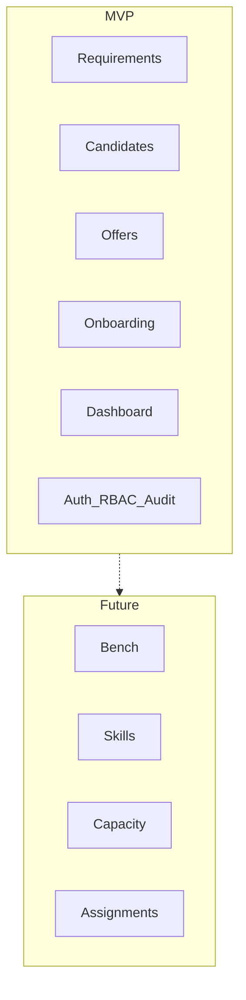

# Vision Document — Service Staffing Tracker

## Purpose

Define product vision, north star, and strategic boundaries for SST.

## Audience

Sponsors, product, engineering leads, future contributors.

## Scope

Vision and goals only. Detailed requirements live in BA / SRS / PRD.

## Definitions

| Term | Definition |
|------|------------|
| Pipeline MVP | Digitized Excel hiring flow |
| Workforce modules | Bench, skills, capacity, assignments (Future) |

---

## Vision statement

> **Service Staffing Tracker** is the system of record for service staffing operations. It starts by replacing the Excel hiring pipeline (requirement → TA → offer → onboarding → dashboard) with a secure, multi-user web application, and is architected so workforce modules (bench, skills, capacity, assignments) can plug in later without rewriting the core.

## North star

Reduce time-to-fill, eliminate spreadsheet fragility, and give Sales, TA, and HR shared real-time visibility with RBAC and an auditable trail.

## Business goals

| ID | Goal | Priority |
|----|------|----------|
| BG-1 | Replace Excel as SoR for hiring pipeline | P0 |
| BG-2 | Enforce stage workflows, SLAs, ownership | P0 |
| BG-3 | Real-time dashboards ≥ Excel parity | P0 |
| BG-4 | Auth, RBAC, audit logs | P0 |
| BG-5 | Notifications for handoffs / SLA breaches | P1 |
| BG-6 | Leadership reporting / export | P1 |
| BG-7 | Pluggable architecture for future modules | P0 (arch only) |
| BG-8 | Migrate Excel data with fidelity | P0 |
| BG-9 | Scale to multi-team without redesign | Constraint |

## Problem statement

Staffing demand is tracked in a sophisticated Excel workbook that lacks concurrent multi-user safety, authentication, authorization, auditability, and clean extensibility into workforce domains.

## Stakeholders

| Stakeholder | Interest |
|-------------|----------|
| Ops / leadership | Fill rate, SLA, visibility |
| Sales Owners | Req intake and status |
| TA Owners | Pipeline integrity, duplicates |
| HR Owners | Offer → join conversion |
| Engineering | Maintainability |
| Security / IT | Access, PII, secrets |

## Success metrics

| Metric | Target |
|--------|--------|
| Adoption | ≥95% new requirements in SST |
| Concurrent editing | Safe multi-user |
| Auth coverage | 100% protected APIs |
| Audit | Critical mutations logged |
| Dashboard | Filterable KPI parity |
| Duplicates | Server-enforced detection |

## MVP vs Future

## Decision rationale

Excel-first MVP maximizes continuity with live operations. Modular monorepo and clean domain boundaries keep future workforce work additive.

## Trade-offs

| Choice | Pros | Cons |
|--------|------|------|
| Pipeline-first | Faster Excel replacement | Workforce delayed |
| Full platform now | One vision | High delay / risk |

**Recommendation:** Pipeline-first.

## References

- Excel workbook in repo root  
- [PROJECT_CHARTER.md](./PROJECT_CHARTER.md)  
- ADR-0001  
