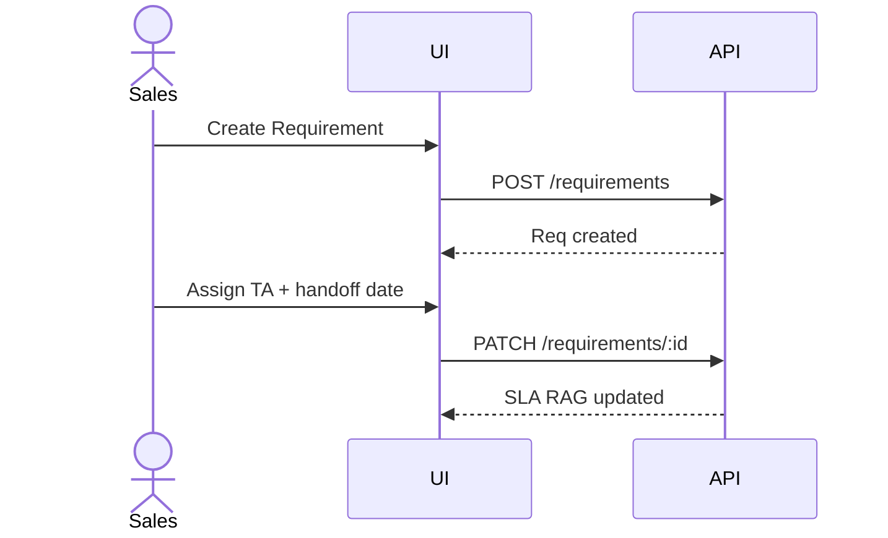

# Personas and User Journeys — SST

## Purpose

Describe who uses SST and primary journeys for UX and acceptance design.

## Audience

UX, product, frontend, QA.

## Scope

MVP personas mapped from Excel owners. Future engineer/bench personas in Future Modules.

## Definitions

| Persona | Primary Excel analog |
|---------|----------------------|
| Avery (Sales) | Sales Owner |
| Taylor (TA) | TA Owner |
| Harper (HR) | HR Owner |
| Riley (Admin) | Setup Lists editor |
| Morgan (Leadership) | Dashboard consumer |

---

## Personas

### Avery — Sales Owner

- **Goals:** Raise client requirements quickly; track handoff to TA; see open positions.
- **Pain today:** Excel locking; unclear TA progress.
- **MVP needs:** Create/edit requirements; set priority; view related candidates (read).

### Taylor — TA Owner

- **Goals:** Source candidates; advance stages; select finalists; avoid duplicates.
- **Pain today:** Formula breakage; hard to filter ownership.
- **MVP needs:** Candidate CRUD; stage/feedback; selection; duplicate warnings.

### Harper — HR Owner

- **Goals:** Move selected → offer → onboarding → joined.
- **Pain today:** Scattered offer/onboarding rows; TAT unclear.
- **MVP needs:** Offer lifecycle; onboarding checklist; DOJ tracking.

### Riley — System Admin

- **Goals:** Master lists, users, roles, import.
- **MVP needs:** Setup lists; user admin; audit access.

### Morgan — Leadership (readonly)

- **Goals:** KPI visibility, risk (RAG), fill rate.
- **MVP needs:** Filtered dashboard; export.

---

## Journeys

### J1 — New client requirement (Sales)

### J2 — Source and select candidate (TA)

1. Open TA queue (requirements with handoff).  
2. Add candidate under Req.  
3. Advance stage (Submitted to SPOC → Client Shortlist).  
4. System flags duplicate mobile if any.  
5. Mark Selected=Yes → offer eligible.

### J3 — Offer and join (HR)

1. Open selected candidates / offers.  
2. Release offer with CTC and Expected DOJ.  
3. Candidate accepts → create onboarding.  
4. Complete docs/BGV; set Actual DOJ; status Joined.  
5. Dashboard closed positions / fill rate updates.

### J4 — Leadership review

1. Open Dashboard.  
2. Filter by Client / TA Owner / date range.  
3. Inspect At Risk / Overdue.  
4. Export CSV (optional).

---

## Accessibility notes

Personas include keyboard-first dense table use; ensure filters and row actions are reachable.

## References

- Excel Dashboard filters and owner columns  
- [../05-ux/USER_FLOWS.md](../05-ux/USER_FLOWS.md)  
