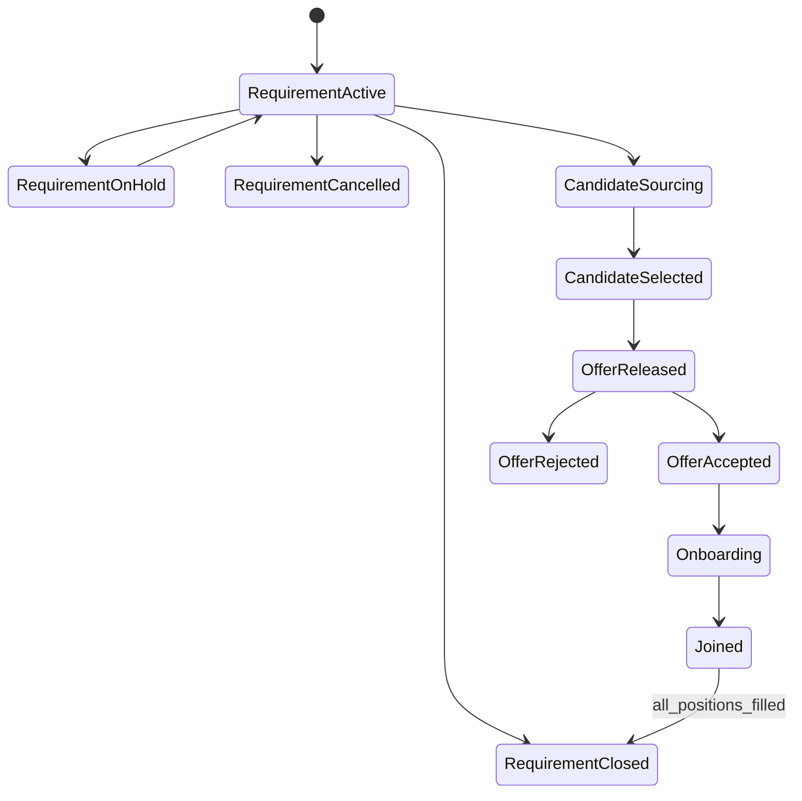
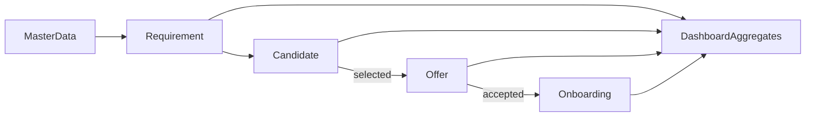

# Workflow Analysis — SST MVP

## Purpose

Document end-to-end staffing workflows, states, and handoffs for implementation and testing.

## Audience

Engineers, QA, product.

## Scope

MVP pipeline. Existing Excel problems called out for replacement.

## Definitions

| Term | Definition |
|------|------------|
| Handoff | Sales → TA ownership transfer via TA Handoff Date |
| Selected flow | Candidate Selected? = Yes → Offer row mapping |

---

## 1. Existing problems (Excel)

| Problem | Impact | System response |
|---------|--------|-----------------|
| Single-file concurrency | Overwrites | Multi-user DB |
| No auth | Accountability gap | JWT + RBAC |
| Fragile formulas | Wrong KPIs | Server aggregates + tests |
| Inconsistent client casing | Bad filters | Normalized masters |
| Hidden helper columns | Operator confusion | Derived fields in API, not editable |
| Limited history | Weak audit | Audit log |

---

## 2. Master workflow



---

## 3. Requirement workflow

| State | Entry | Allowed actions |
|-------|-------|-----------------|
| Active | Create | Edit, assign TA, add candidates |
| On Hold | Status change | Resume, limited edits |
| Cancelled | Status change | View; no new candidates |
| Closed | Positions filled or manual close | View |

**Handoff SLA:** evaluated continuously for dashboard RAG.

---

## 4. Candidate workflow

| Stage (default masters) | Meaning |
|-------------------------|---------|
| Submitted to SPOC | Profile with client contact |
| Client Shortlist | Client interested |
| Hold | Paused |
| Reject | Rejected |

Transitions logged in audit. Selection is orthogonal flag with validation against stage.

---

## 5. Offer workflow

```text
Eligible (Selected) → Initiated → Released → Accepted | Rejected | Withdrawn
```

Accepted → Onboarding create.

---

## 6. Onboarding workflow

```text
Docs Pending → BGV In Progress → Formalities → Joined
```

Statuses from Setup Lists masters; exact names seeded from Excel.

---

## 7. Cross-entity data flow



---

## 8. Exception paths

| Exception | Handling |
|-----------|----------|
| Duplicate candidate contact | Warn; allow with confirmation (Admin/TA policy) |
| Offer accepted then withdrawn | Onboarding cancelled; reopen position |
| Requirement cancelled after TA started | Count as wasted sourcing |
| Partial fill | Remain Active until openPositions=0 or Closed |

## References

- [BUSINESS_RULES.md](./BUSINESS_RULES.md)  
- [PERSONAS_AND_JOURNEYS.md](./PERSONAS_AND_JOURNEYS.md)  
- Excel Data Dictionary fixes for selected flow  
