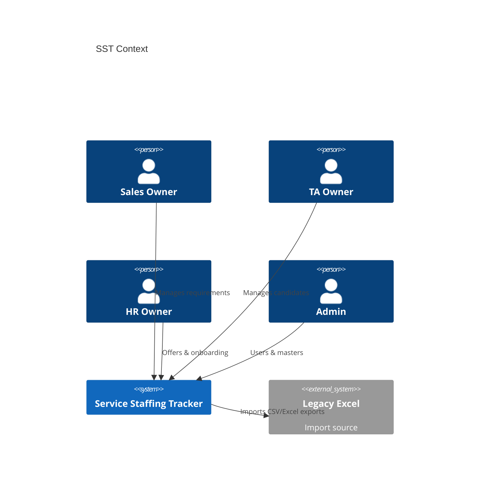

# Software Requirements Specification (SRS) — SST

## Purpose

IEEE-inspired SRS for Service Staffing Tracker MVP.

## Audience

Engineering, QA, architects, vendors/future teams.

## Scope

MVP hiring pipeline application. Future workforce modules referenced but not specified as requirements.

## Definitions

See [../README.md](../README.md). Additional:

| Term | Definition |
|------|------------|
| SoR | System of Record |
| SPA | Single Page Application |

---

## 1. Introduction

### 1.1 Purpose

Specify software requirements for implementing SST MVP.

### 1.2 Product perspective

SST is a modular monolith: React SPA + NestJS API + PostgreSQL, optionally observed via Prometheus/Grafana/Loki in local Compose.

### 1.3 Product functions (summary)

Auth, master data, requirements, candidates, offers, onboarding, dashboard, audit, import/export, notification stubs.

### 1.4 User characteristics

Internal staffing operators comfortable with dense tabular UIs (Excel) and lightweight dashboards.

### 1.5 Constraints

Stack locked (Turborepo/pnpm/React/NestJS/Prisma/PostgreSQL). Single-tenant. Local-first.

### 1.6 Assumptions and dependencies

See Project Charter. Depends on Node LTS, pnpm, Docker Desktop/Engine, PostgreSQL 16.

---

## 2. Overall description

### 2.1 Product interfaces

| Interface | Detail |
|-----------|--------|
| UI | HTTPS/HTTP SPA |
| API | REST `/api/v1` JSON |
| DB | PostgreSQL |
| Metrics | `/metrics` Prometheus |
| Docs | Swagger UI |

### 2.2 User interfaces

Screens: Login, Dashboard, Requirements, Candidates, Offers, Onboarding, Admin (Users, Masters, Audit, Import). See UX docs.

### 2.3 Hardware interfaces

None beyond standard servers/desktops.

### 2.4 Software interfaces

| System | Interface |
|--------|-----------|
| Browser | Chromium/Firefox/Safari modern |
| SMTP (optional) | Future email notifications |
| Object storage | Future; local FS MVP |

### 2.5 Memory / operations / site

Documented in NFRs and Local Deployment.

---

## 3. Specific requirements

### 3.1 Functional requirements

Normative list: [../01-business-analysis/FUNCTIONAL_REQUIREMENTS.md](../01-business-analysis/FUNCTIONAL_REQUIREMENTS.md).

### 3.2 External interface requirements

API normative: [../10-api/API_CATALOG.md](../10-api/API_CATALOG.md).

### 3.3 Performance / design constraints / attributes

[../01-business-analysis/NON_FUNCTIONAL_REQUIREMENTS.md](../01-business-analysis/NON_FUNCTIONAL_REQUIREMENTS.md).

### 3.4 Business rules

[../01-business-analysis/BUSINESS_RULES.md](../01-business-analysis/BUSINESS_RULES.md).

### 3.5 Security requirements

[../11-security/AUTH_RBAC.md](../11-security/AUTH_RBAC.md).

### 3.6 Data requirements

[../07-database/ER_AND_SCHEMA.md](../07-database/ER_AND_SCHEMA.md).

---

## 4. System modes

| Mode | Behavior |
|------|----------|
| Normal | Full CRUD per RBAC |
| Maintenance | Optional read-only flag via env |
| Import | Batch validation mode with report |

---

## 5. Verification

| Method | Applicable to |
|--------|---------------|
| Unit tests | Domain rules, RAG, duplicates |
| Integration | API + DB |
| E2E | Critical journeys J1–J3 |
| Manual UAT | Dashboard parity vs Excel sample |

---

## 6. Appendices

### 6.1 Excel parity note

Public IDs align with samples: `CAN-00006`, `OFF-00001`. Requirements may use numeric legacy IDs on import mapped to `REQ-#####`.

### 6.2 Future (non-normative)

Bench, skills, capacity, assignments — [../04-domain/FUTURE_MODULES.md](../04-domain/FUTURE_MODULES.md).

## References

- IEEE 830 / ISO/IEC/IEEE 29148 practices  
- Project Charter, Vision, RTM  
