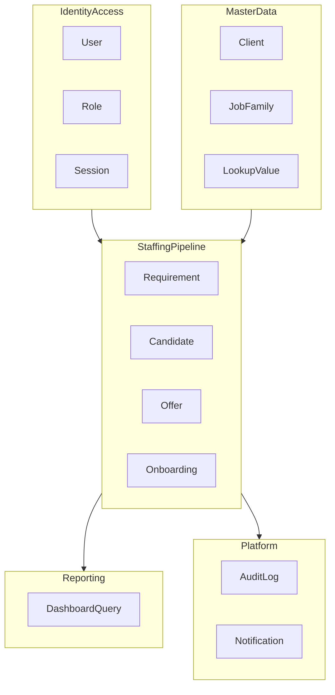
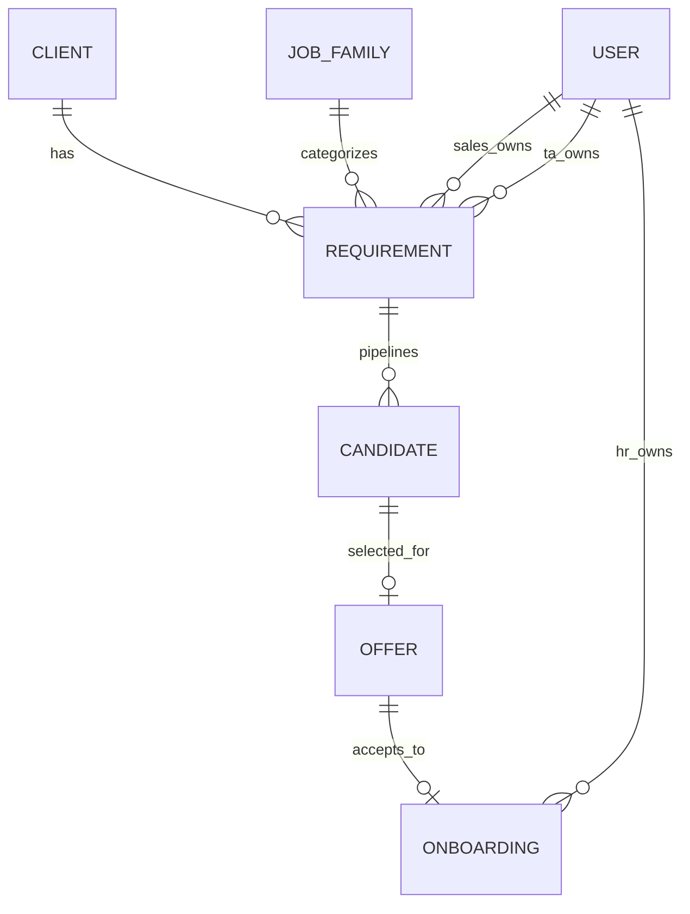

# Domain Model — SST MVP

## Purpose

Define bounded contexts, aggregates, entities, value objects, and relationships for the hiring pipeline.

## Audience

Backend engineers, architects, data modelers.

## Scope

MVP domain. Future contexts sketched only in [FUTURE_MODULES.md](./FUTURE_MODULES.md).

## Definitions

| Term | Definition |
|------|------------|
| Aggregate | Consistency boundary with root entity |
| VO | Immutable value object |
| BC | Bounded context |

---

## 1. Bounded contexts (MVP)

| Context | Responsibility |
|---------|----------------|
| Identity & Access | Users, credentials, roles, tokens |
| Master Data | Configurable lists and directories |
| Staffing Pipeline | Requirements → Candidates → Offers → Onboarding |
| Reporting | Read-model aggregations |
| Platform | Audit, notifications |

---

## 2. Aggregates & entities

### Requirement (aggregate root)

| Field | Type | Notes |
|-------|------|-------|
| id | UUID | Internal PK |
| publicId | string | `REQ-#####` |
| requirementDate | date | |
| clientId | FK | |
| roleSkill | string | |
| jobFamilyId | FK | |
| numberOfPositions | int | ≥1 |
| salesOwnerId | FK User | |
| taOwnerId | FK User nullable | |
| priority | enum/lookup | |
| taHandoffDate | date nullable | |
| targetClosureDate | date nullable | |
| remarks | text | |
| experience | string | |
| jobLocation | string | |
| minBudget / maxBudget | decimal nullable | |
| durationMonths | int nullable | |
| status | enum | Active/OnHold/Cancelled/Closed |
| createdAt/updatedAt/deletedAt | timestamps | soft delete |

**Invariants:** BR-REQ-*; open/closed derived outside mutable write where possible.

### Candidate (aggregate root)

| Field | Notes |
|-------|-------|
| publicId | `CAN-#####` |
| requirementId | Required FK |
| name, mobile, email, mobileNormalized, emailNormalized | |
| source | |
| stage, feedback | lookups |
| profileSubmittedDate, clientShortlistDate | |
| interviewRound | string/int |
| selected | boolean |
| selectedAt | datetime |
| remarks | |
| snapshot fields | clientName, roleSkill, etc. optional denorm |

### Offer (aggregate root)

| Field | Notes |
|-------|-------|
| publicId | `OFF-#####` |
| candidateId, requirementId | FKs |
| selectedDate, offerInitiatedDate, offerReleasedDate | |
| status | lookup |
| ctcRate | string or decimal+currency |
| expectedDoj | date |
| remarks | |

### Onboarding (aggregate root)

| Field | Notes |
|-------|-------|
| publicId | `ONB-#####` |
| offerId, candidateId, requirementId | |
| hrOwnerId | |
| offerAcceptedDate, expectedDoj, actualDoj | |
| docsPending | bool |
| bgvStatus | lookup |
| joiningFormalities | string |
| status | lookup |

### User / Role

User: email, passwordHash, name, isActive, role(s).  
Role: ADMIN, SALES, TA, HR, LEADERSHIP_READONLY.

### Master data

`LookupType` + `LookupValue`, plus first-class `Client`, `JobFamily` tables.

### AuditLog

entityType, entityId, action, actorUserId, beforeJson, afterJson, at.

---

## 3. Value objects

| VO | Fields |
|----|--------|
| MoneyRange | min, max, currency |
| RagStatus | GREEN \| AMBER \| RED |
| PhoneNumber | raw, normalized |
| EmailAddress | raw, normalized |
| DateRangeFilter | from, to |

---

## 4. Relationships

---

## 5. Domain services

| Service | Responsibility |
|---------|----------------|
| SlaRagCalculator | Requirement/candidate/offer/onboarding RAG |
| PositionCounter | Open/closed positions |
| DuplicateDetector | Mobile/email duplicates |
| OfferEligibilityService | Selected → offer rules |
| DashboardAggregator | KPI queries |

---

## 6. Ubiquitous language

| Say | Do not say |
|-----|------------|
| Requirement | Job post (ambiguous) |
| Candidate | Engineer (employee sense) |
| TA Handoff | Assignment (Future meaning) |
| Joined | Hired (payroll sense) |

## Trade-offs

Separate aggregates (Candidate vs Offer) mirror Excel sheets and reduce write contention; eventual UI joins via APIs.

## References

- Excel entities  
- [BUSINESS_PROCESSES.md](./BUSINESS_PROCESSES.md)  
- [../07-database/ER_AND_SCHEMA.md](../07-database/ER_AND_SCHEMA.md)  
