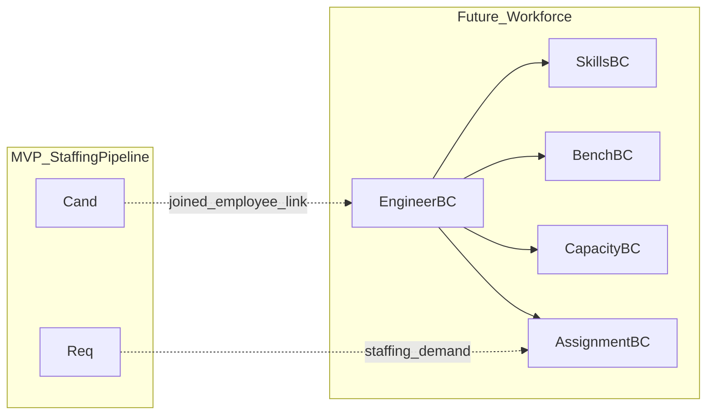

# Future Modules — Workforce Extensions

## Purpose

Architect pluggable future capabilities without committing MVP scope.

## Audience

Architects, product, future feature teams.

## Scope

**Not build-ready for MVP.** Defines bounded contexts, extension seams, and non-goals for current release.

## Definitions

| Module | Intent |
|--------|--------|
| Engineers | Internal employee master |
| Bench | Unallocated billable/non-billable pool |
| Skills Matrix | Skill taxonomy + proficiency |
| Capacity | Hours/FTE available over time |
| Availability | Leaves/blockers |
| Assignments | Engineer ↔ project/engagement |
| Workload | Utilization views |

---

## 1. Why deferred

Excel SoR is a **hiring pipeline**, not an internal resource management system. Building both simultaneously delays Excel replacement.

## 2. Target bounded contexts (Future)

## 3. Extension seams (build in MVP architecture)

| Seam | MVP action |
|------|------------|
| Monorepo packages | Reserve `packages/` or `apps/api` modules namespace `workforce/*` empty |
| Shared identity | Users may later link to Engineer profiles |
| Event hooks | Domain events: `CandidateJoined` → future `CreateEngineerFromJoiner` |
| API versioning | `/api/v1` stable; future routes under `/api/v1/workforce/...` |
| DB schemas | PostgreSQL schema `workforce` later; MVP uses `public`/`app` |

## 4. Future aggregates (sketch only)

### Engineer

employeeCode, userId?, skills[], benchStatus, costCenter.

### Skill & SkillAssessment

skillId, level (1–5), lastAssessedAt.

### Assignment

engineerId, clientId/projectId, allocationPercent, start/end, requirementId?.

### CapacitySlot

engineerId, week, availableHours, bookedHours.

## 5. Integration with MVP pipeline

| Event | Future reaction |
|-------|-----------------|
| Onboarding.Joined | Optionally create Engineer draft |
| Requirement created | Appear as demand signal in capacity planning |
| Skills on Role/Skill text | Later map to skill taxonomy |

## 6. Explicit non-goals until approved PRD for workforce

- UI for bench boards  
- Capacity calendars  
- Assignment conflict engines  
- Skills gap analytics  

## 7. Recommended delivery order (post-MVP)

1. Engineer master linked from Joined candidates  
2. Skills taxonomy  
3. Bench status  
4. Assignments  
5. Capacity & workload dashboards  

## Trade-offs

| Approach | Pros | Cons |
|----------|------|------|
| Separate BC + schema | Clear isolation | Cross-context queries harder |
| Expand StaffingPipeline | Faster demos | Coupling / god context |

**Recommendation:** Separate `workforce` BC and schema after MVP stability.

## References

- ADR-0001, ADR-0002  
- [DOMAIN_MODEL.md](./DOMAIN_MODEL.md)  
