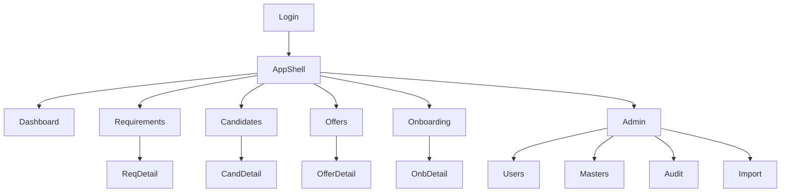

# Information Architecture & Navigation — SST

## Purpose

Define IA, primary navigation, and information hierarchy for the SPA.

## Audience

UX, frontend engineers.

## Scope

MVP screens. Future workforce nav reserved under disabled/hidden section.

## Definitions

| Term | Definition |
|------|------------|
| Shell | App chrome: nav, header, user menu |
| Route module | Feature area under React Router |

---

## 1. Sitemap



## 2. Primary navigation

| Item | Route | Roles |
|------|-------|-------|
| Dashboard | `/` | All authenticated |
| Requirements | `/requirements` | Sales, TA, Admin, Leadership |
| Candidates | `/candidates` | TA, Sales(read), Admin, Leadership |
| Offers | `/offers` | HR, TA, Admin, Leadership |
| Onboarding | `/onboarding` | HR, Admin, Leadership |
| Admin | `/admin` | Admin |

## 3. Secondary patterns

- List → Detail drawer or page  
- Detail tabs: Overview / Activity (audit subset) / Related  
- Global filter chips on Dashboard  
- Command-like search on lists (name, id, client)

## 4. Object hierarchy

```text
Client
 └── Requirement
      └── Candidate
           └── Offer
                └── Onboarding
```

## 5. Future nav (hidden)

`Workforce` → Engineers / Bench / Skills / Capacity / Assignments (feature-flagged false).

## Recommendations

Prefer left nav for enterprise ops density; top bar for user/tenant/theme.

## References

- Excel sheet names map 1:1 to primary nav  
- [USER_FLOWS.md](./USER_FLOWS.md)  
