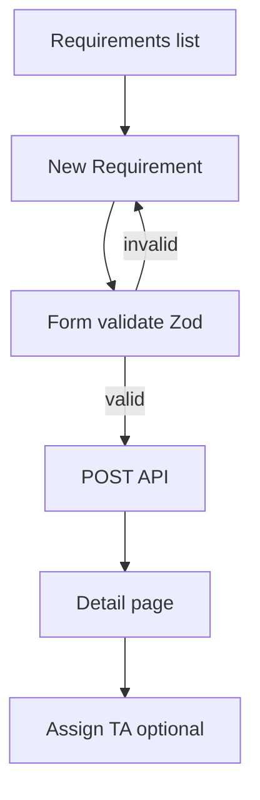

# User Flows & Screen Flows — SST

## Purpose

Detail click-level flows for implementation and E2E tests.

## Audience

Frontend, QA, UX.

## Scope

MVP critical paths.

## Definitions

| Flow | ID |
|------|-----|
| Login | F-LOGIN |
| Create requirement | F-REQ-CREATE |
| Add candidate | F-CAN-ADD |
| Select + offer | F-OFF-CREATE |
| Onboard join | F-ONB-JOIN |
| Dashboard filter | F-DASH-FILTER |

---

## F-LOGIN

1. `/login` → enter email/password.  
2. Success → store tokens (memory + httpOnly refresh cookie preferred) → `/`.  
3. Failure → inline error; lockout messaging per NFR.

## F-REQ-CREATE

## F-CAN-ADD

1. From Req detail → Add Candidate OR Candidates → New with Req picker.  
2. Prefill snapshot fields.  
3. On save, show duplicate banners if any.  
4. Stage updates via inline select.

## F-OFF-CREATE

1. Candidate Selected toggle ON → CTA “Create Offer”.  
2. Offer form dates/CTC/DOJ.  
3. Status Released → Accepted.  
4. CTA “Start Onboarding”.

## F-ONB-JOIN

1. Fill HR owner, docs, BGV.  
2. Set Actual DOJ.  
3. Status Joined → toast success; link back to Requirement.

## F-DASH-FILTER

1. Change TA Owner / Client / dates.  
2. Debounce 300ms → refetch summary.  
3. URL query sync for shareability.

## Error / empty / loading states

| State | UX |
|-------|----|
| Loading | Skeleton tables / KPI pulse |
| Empty | Illustrated empty with primary CTA |
| Error | Banner + retry |
| Forbidden | 403 page with role hint |

## References

- [PERSONAS_AND_JOURNEYS.md](../01-business-analysis/PERSONAS_AND_JOURNEYS.md)  
- [WIREFRAMES.md](./WIREFRAMES.md)  
