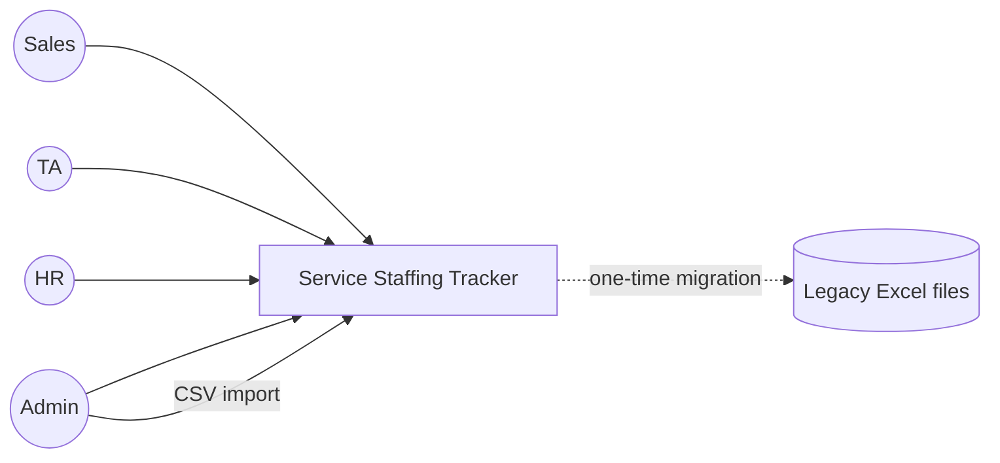
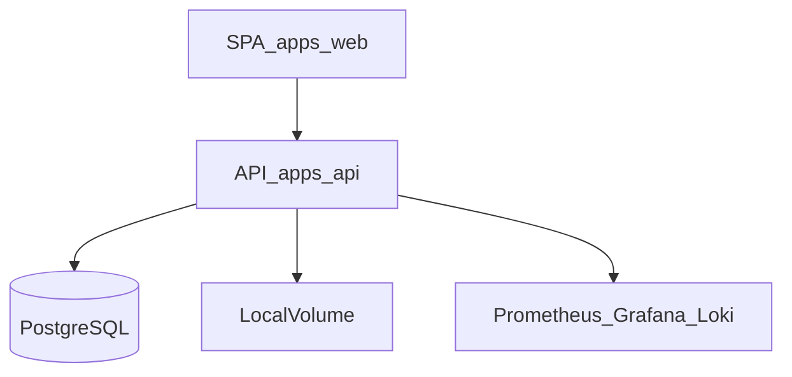
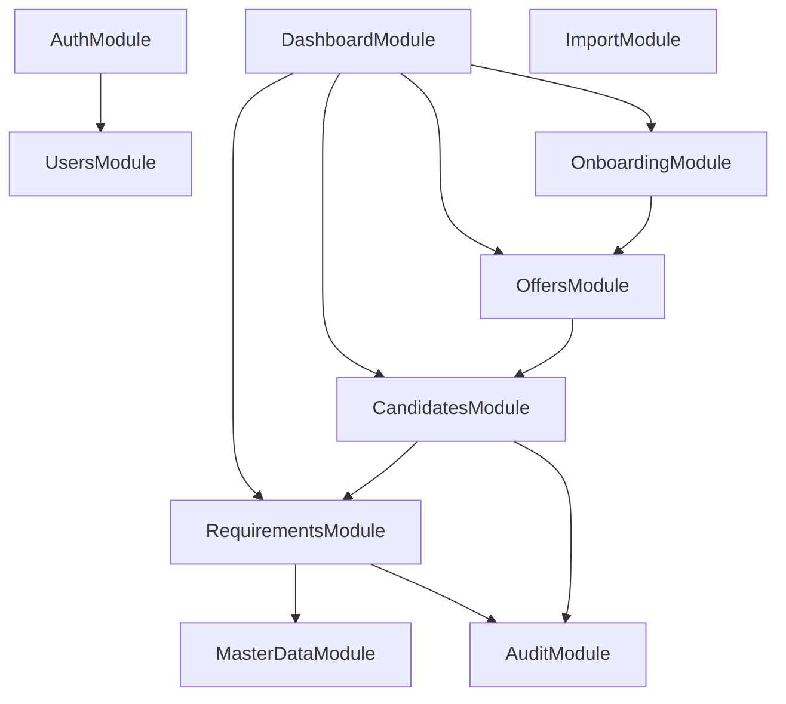

# C4 Model — SST

## Purpose

C4 views for shared architecture understanding.

## Audience

Engineers, architects.

## Scope

MVP context, containers, components. Code-level optional.

## Definitions

C4: Context, Container, Component, Code.

---

## Level 1 — Context

## Level 2 — Containers

| Container | Technology | Notes |
|-----------|------------|-------|
| Web | React Vite | Port 5173 |
| API | NestJS | Port 3000 |
| DB | PostgreSQL 16 | Port 5432 |
| Monitoring | Prom/Grafana/Loki | Local |

## Level 3 — API components

## Level 3 — Web components

- `app` shell (router, auth provider, query client)  
- `features/*` (dashboard, requirements, candidates, offers, onboarding, admin)  
- `shared/ui`, `shared/api`, `shared/lib`  

## Code (illustrative)

`RequirementsService.create` → `RequirementsRepository.insert` → Prisma `requirement.create` → `AuditService.record`.

## References

- [HIGH_LEVEL_ARCHITECTURE.md](./HIGH_LEVEL_ARCHITECTURE.md)  
- [SEQUENCE_DIAGRAMS.md](./SEQUENCE_DIAGRAMS.md)  
