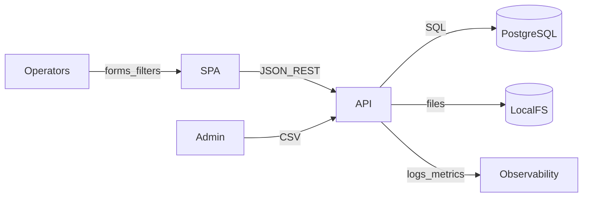
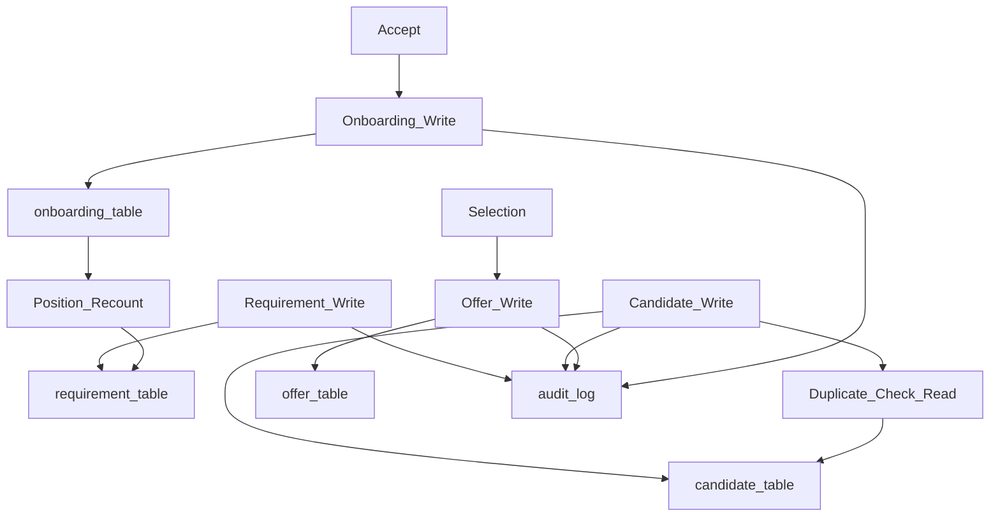

# Data Flow Diagram — SST

## Purpose

Show how data moves through SST for pipeline operations and analytics.

## Audience

Architects, data engineers, backend.

## Scope

MVP. No external integrations beyond optional SMTP later.

## Definitions

| Store | Contents |
|-------|----------|
| PostgreSQL | SoR |
| Local FS | Import temp / future docs |
| Log stream | Pino → Promtail → Loki |

---

## Context DFD

## Level 1 — Pipeline writes

## Dashboard read path

Filters → parameterized SQL aggregates → DTO → SPA charts/tables.

PII fields in logs must be masked (mobile/email).

## References

- [../07-database/ER_AND_SCHEMA.md](../07-database/ER_AND_SCHEMA.md)  
- [DEPLOYMENT.md](./DEPLOYMENT.md)  
