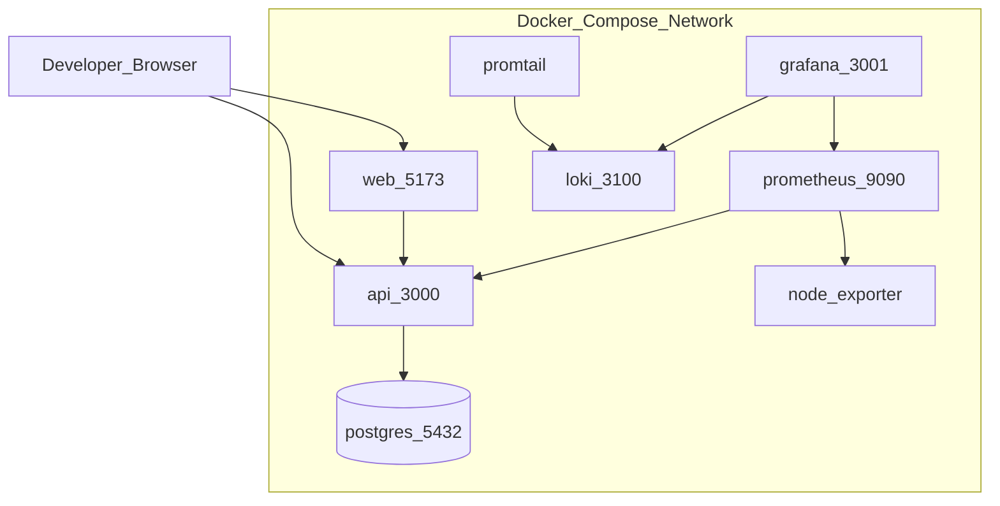

# Deployment Diagram — SST Local

## Purpose

Define local containerized deployment topology for Phase 1–2.

## Audience

DevOps, developers.

## Scope

Docker Compose local. Cloud separately documented.

## Definitions

| Service | Role |
|---------|------|
| `api` | NestJS |
| `web` | Nginx or Vite preview / dev |
| `postgres` | DB |
| `prometheus` / `grafana` / `loki` / `promtail` / `node-exporter` | Observability |

---

## Diagram

## Communication

| From | To | Protocol |
|------|----|----------|
| Browser | Web | HTTP |
| Browser / Web | API | HTTP JSON |
| API | Postgres | TCP 5432 |
| Prometheus | API `/metrics` | scrape |
| Promtail | API logs volume | scrape files/docker logs |

## Volumes

- `pgdata` persistence  
- `api_uploads` local files  
- `grafana_data`, `prometheus_data`  

## Health checks

- API: `GET /health`  
- Postgres: `pg_isready`  
- Web: HTTP 200 on `/`  

## References

- [../17-local-deployment/DOCKER_COMPOSE.md](../17-local-deployment/DOCKER_COMPOSE.md)  
- [SCALABILITY.md](./SCALABILITY.md)  
