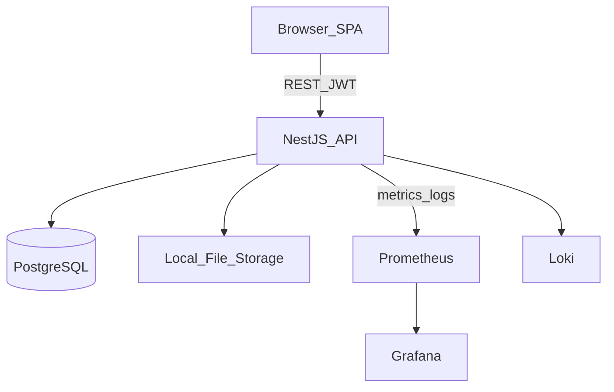

# High Level Architecture — SST

## Purpose

Describe the system architecture for MVP and extension points.

## Audience

Architects, senior engineers, DevOps.

## Scope

Local/Docker modular monolith. Cloud in `19-cloud`.

## Definitions

| Term | Definition |
|------|------------|
| Modular monolith | Single deployable API with bounded modules |
| BFF | Not used; SPA talks REST directly |

---

## 1. Architecture style

- Enterprise monorepo (Turborepo)  
- Modular monolith NestJS API  
- React SPA  
- PostgreSQL SoR  
- Clean / layered architecture inside modules  
- Future Redis / object storage adapters  



## 2. Logical layers (API)

```text
Controllers (HTTP) → Application Services → Domain Services → Repositories (Prisma) → DB
         ↘ Guards / Interceptors / Pipes / Filters
```

## 3. Applications

| App | Tech | Responsibility |
|-----|------|----------------|
| `apps/web` | Vite React | UI |
| `apps/api` | NestJS | Business APIs |
| `docker/*` | Compose | Local runtime |

## 4. Cross-cutting

AuthN/Z, validation (class-validator + Zod shared), logging (Pino), config (`@nestjs/config`), OpenAPI, pagination, error envelope, audit.

## 5. Scalability strategy (MVP → next)

| Stage | Approach |
|-------|----------|
| MVP | Single API replica + Postgres |
| Growth | Stateless horizontal API; Pg pool; read indexes |
| Later | Redis cache for dashboard; read replicas; object storage |

## 6. Trade-offs

| Decision | Why |
|----------|-----|
| Modular monolith | Solo speed + future team seams |
| No BFF | Simpler; shared types package |
| Sync REST | Matches CRUD Excel mental model |

## Recommendations

Keep modules independently foldered (`requirements`, `candidates`, …) with no cross-Prisma leaks; use application services for orchestration.

## References

- ADR-0002  
- [C4_MODEL.md](./C4_MODEL.md)  
- [../13-monorepo/MONOREPO_STRUCTURE.md](../13-monorepo/MONOREPO_STRUCTURE.md)  
