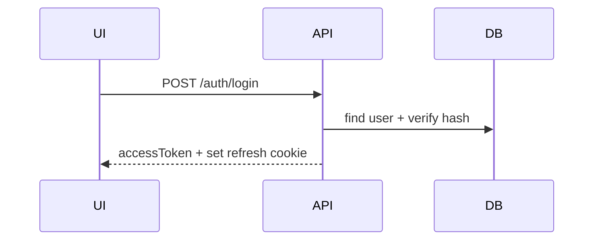
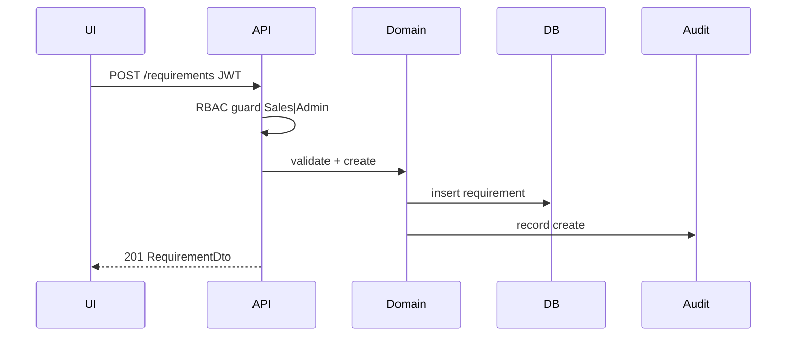
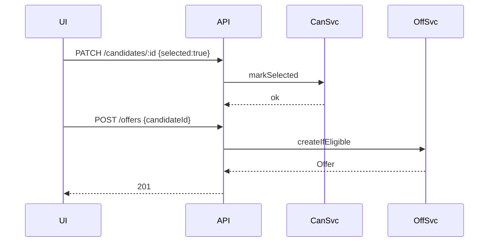
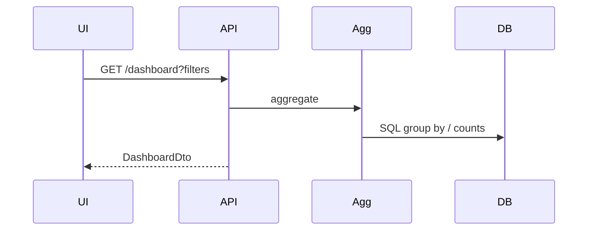
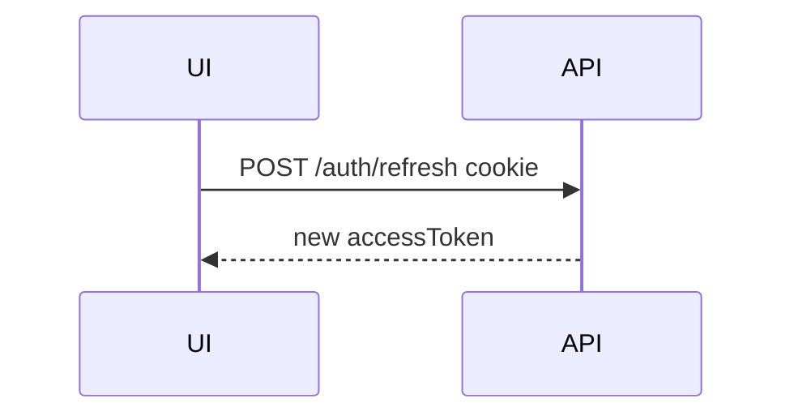

# Sequence Diagrams — SST

## Purpose

Document key runtime sequences for implementers and reviewers.

## Audience

Backend/frontend engineers, QA.

## Scope

MVP critical paths.

## Definitions

Access token: short-lived JWT. Refresh token: longer-lived, rotatable.

---

## 1. Login



## 2. Create requirement



## 3. Select candidate → create offer



## 4. Accept offer → onboarding → joined

```mermaid
sequenceDiagram
  participant UI
  participant API
  participant Off
  participant Onb
  participant Pos
  UI->>API: PATCH /offers/:id {status:Accepted}
  API->>Off: transition
  UI->>API: POST /onboardings
  API->>Onb: create
  UI->>API: PATCH /onboardings/:id {status:Joined, actualDoj}
  API->>Onb: complete
  API->>Pos: recount closed/open
  API-->>UI: 200
```

## 5. Dashboard query



## 6. Token refresh



## References

- [../10-api/API_CATALOG.md](../10-api/API_CATALOG.md)  
- [../11-security/AUTH_RBAC.md](../11-security/AUTH_RBAC.md)  
