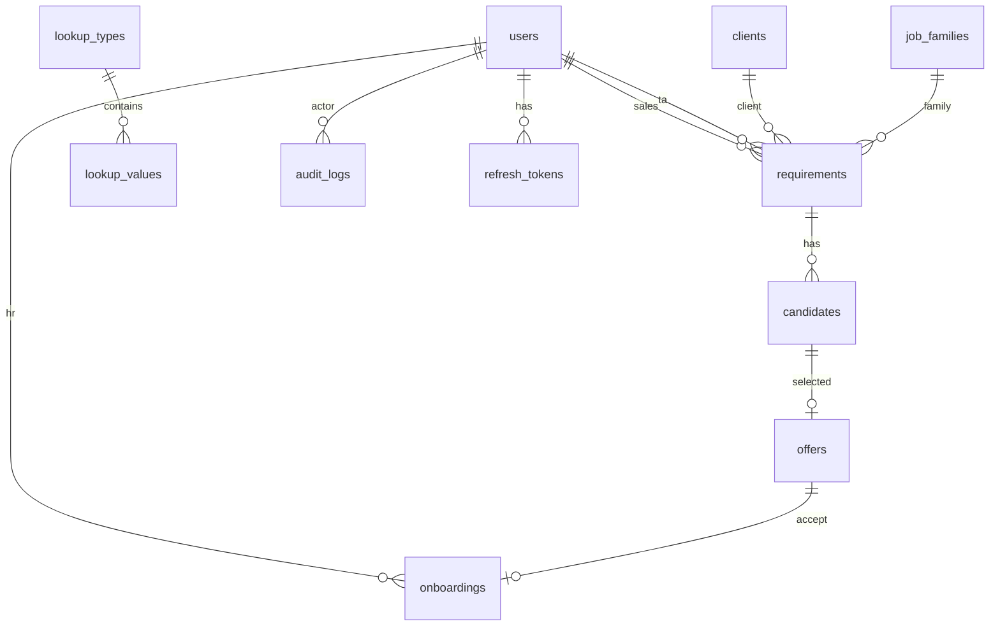

# ER Diagram & PostgreSQL Schema — SST

## Purpose

Canonical relational design for MVP.

## Audience

Database architects, backend engineers.

## Scope

MVP tables. Workforce schema deferred.

## Definitions

| Convention | Rule |
|------------|------|
| PK | UUID `id` |
| Public business id | `public_id` unique text |
| Soft delete | `deleted_at` timestamptz null |
| Money | `numeric(14,2)` |

---

## ER diagram

## Tables (summary)

### users
`id`, `email` unique, `password_hash`, `full_name`, `role` (enum), `is_active`, timestamps, `deleted_at`

### refresh_tokens
`id`, `user_id`, `token_hash`, `expires_at`, `revoked_at`, `created_at`

### clients
`id`, `name`, `name_normalized` unique, timestamps, `deleted_at`

### job_families
`id`, `name` unique, ...

### lookup_types / lookup_values
Types: PRIORITY, CANDIDATE_STAGE, FEEDBACK, OFFER_STATUS, ONBOARDING_STATUS, BGV_STATUS, REQUIREMENT_STATUS  
Values: `code`, `label`, `sort_order`, `is_active`

### requirements
All FR-REQ fields; FKs to clients, job_families, users; `status`; budgets; soft delete

### candidates
FK `requirement_id`; contact + normalized; stage/feedback codes; `selected`; soft delete

### offers
FK candidate/requirement; dates; status; `ctc_rate`; `expected_doj`

### onboardings
FK offer/candidate/requirement; hr user; docs/bgv/formalities; doj; status

### audit_logs
`entity_type`, `entity_id`, `action`, `actor_user_id`, `before_json`, `after_json`, `created_at`

### notifications (optional MVP)
`user_id`, `type`, `payload_json`, `read_at`

### id_sequences (optional)
For generating `REQ-#####` etc.

## Normalization

3NF for transactional tables; controlled denormalization snapshots on candidate/offer for historical fidelity (client/role at time of row).

## Constraints

- `number_of_positions >= 1`  
- `min_budget <= max_budget` when both set  
- FK ON DELETE RESTRICT for referenced masters  
- Partial unique indexes on active emails  

## Excel ID mapping

Import may keep legacy numeric Req IDs in `legacy_req_id` column optional.

## References

- [PRISMA_DESIGN.md](./PRISMA_DESIGN.md)  
- [INDEXING_AND_AUDIT.md](./INDEXING_AND_AUDIT.md)  
