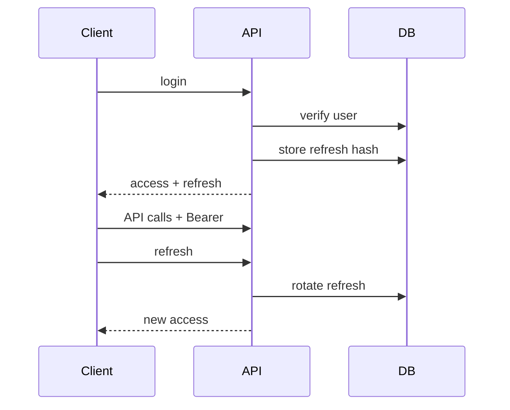

# Authentication & Authorization — SST

## Purpose

Specify JWT/refresh auth and RBAC design.

## Audience

Security, backend, frontend.

## Scope

MVP email/password. SSO Future.

## Definitions

| Term | Definition |
|------|------------|
| Access JWT | Short-lived API credential |
| Refresh | Opaque token hashed at rest |
| RBAC | Role-based access control |

---

## 1. Authentication flow

1. User submits credentials.  
2. Server verifies password (argon2id preferred; bcrypt acceptable).  
3. Issues access JWT (claims: `sub`, `role`, `email`) + refresh token.  
4. Client uses Bearer access; refreshes on 401.  
5. Logout revokes refresh.

## 2. JWT strategy (Passport)

- Algorithm HS256 (MVP); RS256 later for multi-service.  
- Access TTL 15m; Refresh 7d.  
- Validate `isActive`.  

## 3. Password strategy

- Min 10 chars; complexity optional.  
- Hash argon2id/bcrypt cost ≥ 12.  
- Reset via Admin for MVP (no email reset required).  

## 4. Authorization

Role enum on user (single primary role MVP; multi-role Future).  
`RolesGuard` on controllers. Fine-grained permissions optional matrix codes.

## 5. Encryption & secrets

| Secret | Storage |
|--------|---------|
| JWT secrets | env |
| DB URL | env |
| Never | git |

At-rest DB encryption = volume/disk level locally.

## 6. Session hardening

- Refresh rotation  
- Reuse detection → revoke family (Should)  
- CORS allowlist  
- Helmet  

## Trade-offs

Cookie refresh is safer against XSS but needs CORS/cookie domain care on Vite ports.

## References

- [PERMISSION_MATRIX.md](./PERMISSION_MATRIX.md)  
- [OWASP_AND_SECRETS.md](./OWASP_AND_SECRETS.md)  
- OWASP ASVS  
