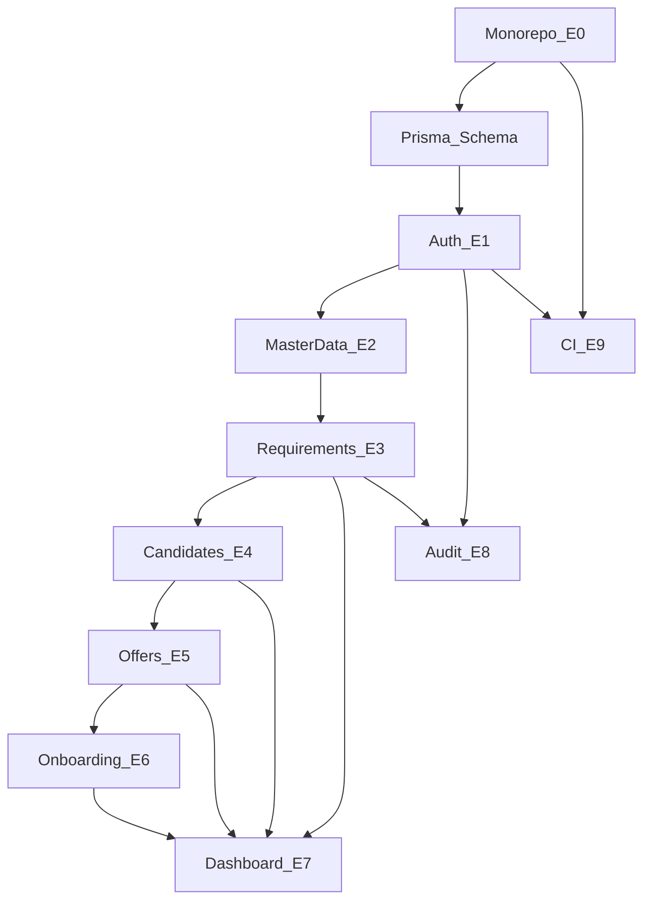

# Dependency Graph — SST Delivery

## Purpose

Make build order explicit to avoid blocked work.

## Audience

Developers, leads.

## Scope

MVP technical & story dependencies.

## Definitions

Hard dependency = cannot start B until A done.

---

## Graph

## Soft dependencies

- UI shell can start after auth skeleton.  
- Dashboard stubs can return zeros before all entities exist.  
- Import after requirements+candidates stable.

## Parallelization

| Track A | Track B |
|---------|---------|
| API requirements | Web shell + design tokens |
| API candidates | Requirements UI |
| Observability compose | Feature UI |

## References

- [SPRINT_AND_MILESTONES.md](./SPRINT_AND_MILESTONES.md)  
- [TEAM_SPRINT_PLAN.md](./TEAM_SPRINT_PLAN.md)  
