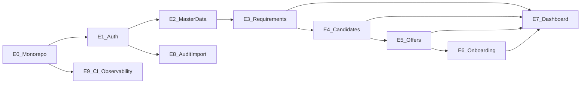

# Epics & User Stories — SST MVP

## Purpose

Provide implementable backlog for building SST from scratch.

## Audience

Engineering manager, developers, QA.

## Scope

MVP epics only. Future workforce as Epic F-* placeholders.

## Definitions

| Term | Definition |
|------|------------|
| Epic | Large theme |
| Story | Independently testable slice |

---

## Epic map

---

## E0 — Monorepo foundation

| ID | Story | Acceptance |
|----|-------|------------|
| E0-S1 | As a dev, I can bootstrap turborepo+pnpm workspaces | `pnpm install` works |
| E0-S2 | As a dev, I can run api and web in turbo | scripts documented |
| E0-S3 | As a dev, I have shared eslint/tsconfig packages | lint/typecheck run |

## E1 — Auth & users

| ID | Story | FR |
|----|-------|-----|
| E1-S1 | Login with email/password returns access token | FR-AUTH-01/02 |
| E1-S2 | Refresh and logout | FR-AUTH-03 |
| E1-S3 | Admin creates users with roles | FR-AUTH-04 |
| E1-S4 | Protected routes redirect unauthenticated users | — |

## E2 — Master data

| ID | Story | FR |
|----|-------|-----|
| E2-S1 | Seed Setup Lists lookups | FR-MD-* |
| E2-S2 | Admin CRUD clients and job families | FR-MD-08/09 |
| E2-S3 | Dropdowns consume master APIs in forms | — |

## E3 — Requirements

| ID | Story | FR |
|----|-------|-----|
| E3-S1 | Create/list/filter requirements | FR-REQ-01/09 |
| E3-S2 | Assign TA + handoff; show SLA RAG | FR-REQ-02/06 |
| E3-S3 | Status transitions + soft constraints | FR-REQ-08 |
| E3-S4 | Derived open/closed/age | FR-REQ-05/07 |

## E4 — Candidates

| ID | Story | FR |
|----|-------|-----|
| E4-S1 | Add candidate to requirement | FR-CAN-01/02 |
| E4-S2 | Stage/feedback updates | FR-CAN-03 |
| E4-S3 | Duplicate mobile/email warnings | FR-CAN-06/07 |
| E4-S4 | Select candidate | FR-CAN-05 |

## E5 — Offers

| ID | Story | FR |
|----|-------|-----|
| E5-S1 | Create offer for selected candidate | FR-OFF-01 |
| E5-S2 | Update offer status/CTC/DOJ | FR-OFF-02/03 |
| E5-S3 | Offer TAT/RAG displayed | FR-OFF-04 |

## E6 — Onboarding

| ID | Story | FR |
|----|-------|-----|
| E6-S1 | Create onboarding from accepted offer | FR-ONB-01 |
| E6-S2 | Track docs/BGV/formalities | FR-ONB-03 |
| E6-S3 | Mark Joined with actual DOJ; positions update | FR-ONB-04/06 |

## E7 — Dashboard

| ID | Story | FR |
|----|-------|-----|
| E7-S1 | KPI summary cards | FR-DASH-01..04 |
| E7-S2 | Stage/RAG breakdowns | FR-DASH-05/06 |
| E7-S3 | Filters + escalations | FR-DASH-07/09 |

## E8 — Audit & import

| ID | Story | FR |
|----|-------|-----|
| E8-S1 | Mutations write audit logs | FR-AUD-01 |
| E8-S2 | Admin query audits | FR-AUD-02 |
| E8-S3 | CSV validate + commit requirements/candidates | FR-IMP-01/03 |

## E9 — CI & observability

| ID | Story | NFR |
|----|-------|-----|
| E9-S1 | GH Actions lint/test/build | NFR-MAIN |
| E9-S2 | Health + metrics endpoints | NFR-OBS |
| E9-S3 | Compose monitoring stack docs verified | — |

## Future placeholders

| ID | Epic |
|----|------|
| F1 | Engineers master |
| F2 | Skills matrix |
| F3 | Bench & assignments |
| F4 | Capacity & workload |

## References

- [SPRINT_AND_MILESTONES.md](./SPRINT_AND_MILESTONES.md)  
- [TEAM_SPRINT_PLAN.md](./TEAM_SPRINT_PLAN.md)  
- [../03-prd/PRD.md](../03-prd/PRD.md)  
