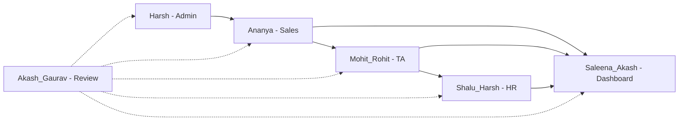

# Team Sprint Plan — SST MVP

## Purpose

Assign module ownership, break each module into small demoable steps, and sequence 8 sprints so the team can develop and showcase progress to management.

## Audience

Engineering manager, module owners, QA/review, developers.

## Scope

MVP pipeline only: Auth / Masters → Requirements → Candidates → Offers → Onboarding → Dashboard → Audit / Import. Aligns with [EPICS_AND_STORIES.md](./EPICS_AND_STORIES.md) and [SPRINT_AND_MILESTONES.md](./SPRINT_AND_MILESTONES.md).

**Live tracker workbook:** [SST_Sprint_Planning_Tracker.xlsx](./SST_Sprint_Planning_Tracker.xlsx) — update Status / % Done on the Sprint Backlog sheet; Dashboard KPIs and charts refresh via formulas.

## Definitions

| Term | Definition |
|------|------------|
| Step ID | Short id for a demoable slice (e.g. `S-4`, `T-M3`) |
| Handoff contract | Done criteria before the next module owner can start |
| Review | Cross-cutting acceptance and demo prep (not a product module) |

---

## 1. Module ownership

| Module / Department | Member(s) | Primary epics | Demo focus |
|---------------------|-----------|---------------|------------|
| Sales | Ananya | E3 Requirements | Create req → assign TA → status / SLA |
| Talent Acquisition (TA) | Mohit & Rohit | E4 Candidates (+ offer handoff) | Add candidate → stages → select → offer |
| HR | Shalu & Harsh | E6 Onboarding (+ offer accept) | Accept offer → docs / BGV → Joined |
| Admin | Harsh | E1 / E2 / E8 Auth, Masters, Audit, Import | Users, dropdowns, audit, CSV import |
| Dashboard | Saleena & Akash | E7 Dashboard | KPI cards, filters, RAG / stage views |
| Review | Akash & Gaurav | Cross-cutting QA | Demo checklist, bugs, acceptance |

### Offer ownership split

Offers sit between TA and HR:

- **Rohit (TA)** — create → release
- **Shalu (HR)** — accept → onboarding
- If a single Offer owner is preferred, assign Rohit end-to-end until Accept

### Dependency rule

Sales → TA → HR → Dashboard enrichment. Admin unlocks everyone. Review runs every sprint.

---

## 2. Milestone cadence

| Milestone | Sprints | Theme | Manager demo |
|-----------|---------|-------|--------------|
| M1 Foundations | S1–S2 | Login, masters, requirements | Login as roles; create a requirement |
| M2 Pipeline | S3–S4 | Candidates + selection | Full TA pipeline on one req |
| M3 Close the loop | S5–S6 | Offers → onboarding → join | Candidate selected → joined |
| M4 Insights & harden | S7–S8 | Dashboard, import, polish | Live KPIs + Excel import |

Sprint length: **1–2 weeks**. Adjust capacity freely.

---

## 3. Per-person step backlog

Each step is small and demoable. **Done** when UI + API (where applicable) + a short test note exist. Link PRs to the Step ID.

### 3.1 Ananya — Sales (Requirements)

| Sprint | Step | Deliverable | Demo line |
|--------|------|-------------|-----------|
| S1 | S-1 | Requirements **list** page (table, search, basic filters) | “Here’s all open demand” |
| S1 | S-2 | **Create requirement** form (client, role, positions, sales owner, priority) | “New req in 1 minute” |
| S2 | S-3 | Requirement **detail** page + edit | “Edit without breaking Excel rules” |
| S2 | S-4 | **Assign TA** + TA handoff date | “Sales → TA handoff” |
| S3 | S-5 | Status transitions: Active / On Hold / Cancelled / Closed | “Lifecycle controls” |
| S3 | S-6 | Derived fields: age, open/closed positions, TA handoff **RAG** | “SLA visible without Excel formulas” |
| S4+ | S-7 | Role-scoped default filter (`salesOwner = me`) + empty/error polish | “My book of business” |

Maps to: E3-S1…E3-S4, FR-REQ-*.

### 3.2 Mohit — TA (Candidates — sourcing & stages)

| Sprint | Step | Deliverable | Demo line |
|--------|------|-------------|-----------|
| S2 | T-M1 | Candidates **list** + filter by requirement | “Pipeline inventory” |
| S3 | T-M2 | **Add candidate** from requirement detail (prefill client/role/owners) | “Add profile in context” |
| S3 | T-M3 | Stage + feedback updates (dropdowns from masters) | “Stage moves like Excel, but audited” |
| S4 | T-M4 | Profile submitted / shortlist dates + interview round | “Interview tracking” |
| S4 | T-M5 | Candidate detail page + pipeline age / candidate RAG | “Aging & risk” |
| S5 | T-M6 | Duplicate **mobile/email** warning banner (with confirm) | “No silent duplicates” |

Maps to: E4-S1…E4-S3, FR-CAN-*. Soft start in S2 once masters + reqs exist.

### 3.3 Rohit — TA (Selection → Offer handoff)

| Sprint | Step | Deliverable | Demo line |
|--------|------|-------------|-----------|
| S3 | T-R1 | Candidate form validation + link integrity to Req ID | “Data quality at entry” |
| S4 | T-R2 | **Select candidate** (Selected = Yes) with business rules | “Selection gate” |
| S5 | T-R3 | **Create offer** from selected candidate (dates, CTC, DOJ, status) | “Offer initiated” |
| S5 | T-R4 | Offer list + detail; status Initiated → Released | “Offer tracker” |
| S6 | T-R5 | Offer TAT / RAG + block invalid/conflicting offers | “Offer SLA & rules” |
| S6 | T-R6 | CTA: Accepted → “Start onboarding” (hand to HR) | “Clean TA → HR handoff” |

Maps to: E4-S4, E5-S1…E5-S3, FR-CAN-05, FR-OFF-*.

### 3.4 Shalu — HR (Onboarding core)

| Sprint | Step | Deliverable | Demo line |
|--------|------|-------------|-----------|
| S5 | H-S1 | Onboarding **list** page | “Join pipeline visible” |
| S5 | H-S2 | **Create onboarding** from accepted offer + assign HR owner | “HR takes ownership” |
| S6 | H-S3 | Track docs pending, BGV status, joining formalities | “Pre-join checklist” |
| S6 | H-S4 | Expected/actual DOJ + onboarding status flow | “Docs → BGV → formalities → Joined” |
| S7 | H-S5 | Mark **Joined** → closed positions update on requirement | “Fill rate updates live” |
| S7 | H-S6 | Onboarding TAT / RAG + cancel path if offer withdrawn | “Exception handling” |

Maps to: E6-S1…E6-S3, FR-ONB-*.

### 3.5 Harsh — Admin (+ HR support)

Admin is primary. Help Shalu on HR when Admin work is ahead.

| Sprint | Step | Track | Deliverable | Demo line |
|--------|------|-------|-------------|-----------|
| S1 | A-1 | Admin | Login + JWT session + role-based route guards | “Secure access” |
| S1 | A-2 | Admin | Seed + serve **Setup Lists** (stages, statuses, priorities…) | “Dropdowns match Excel” |
| S2 | A-3 | Admin | Admin **Users** CRUD (create/disable, assign roles) | “Provision Sales/TA/HR” |
| S2 | A-4 | Admin | **Clients** + **Job Families** CRUD | “Normalized masters” |
| S3 | A-5 | Admin | Wire all forms to master-data APIs | “No hard-coded lists” |
| S4 | A-6 | Admin | **Audit log** write on mutations + Admin audit viewer | “Who changed what” |
| S5–S6 | A-H | HR support | Pair on onboarding RBAC / Joined position logic | “HR rules enforced server-side” |
| S6–S7 | A-7 | Admin | **CSV import** validate → commit (reqs/candidates) | “Excel migration path” |

Maps to: E1, E2, E8, FR-AUTH-*, FR-MD-*, FR-AUD-*, FR-IMP-*.

### 3.6 Saleena — Dashboard (KPIs & layout)

| Sprint | Step | Deliverable | Demo line |
|--------|------|-------------|-----------|
| S2 | D-S1 | Dashboard shell + loading skeletons | “Home page ready” |
| S3 | D-S2 | KPI cards: total reqs, positions, open/closed | “Demand snapshot” |
| S4 | D-S3 | KPIs: pending sales handoff, candidates in pipeline, selected, offers, joined | “Funnel snapshot” |
| S5 | D-S4 | Duplicate mobiles count card | “Data quality KPI” |
| S6 | D-S5 | Candidate **stage summary** table | “Where candidates sit” |
| S7 | D-S6 | Requirement **RAG summary** + empty-state polish | “SLA health” |

Maps to: E7-S1…E7-S2, FR-DASH-01…06.

### 3.7 Akash — Dashboard (filters) + Review lead

| Sprint | Step | Track | Deliverable | Demo line |
|--------|------|-------|-------------|-----------|
| S3 | D-A1 | Dashboard | Filter bar: TA owner, client, date range | “Slice the book” |
| S4 | D-A2 | Dashboard | Debounced refetch + URL query sync (shareable filters) | “Shareable leadership view” |
| S5 | D-A3 | Dashboard | Escalations / RED items list | “What needs attention today” |
| S6 | D-A4 | Dashboard | Align API aggregations with Excel KPI definitions | “Parity with workbook” |
| Every | R-A1 | Review | Sprint demo script + acceptance checklist | “Manager walkthrough ready” |
| Every | R-A2 | Review | Smoke test critical path for merged PRs | “Nothing broken before demo” |

Maps to: E7-S3, FR-DASH-07/09.

### 3.8 Gaurav — Review (QA / acceptance)

| Sprint | Step | Deliverable | Demo line |
|--------|------|-------------|-----------|
| S1 | R-G1 | Test accounts per role (Admin/Sales/TA/HR/Lead) + login matrix | “RBAC demo prep” |
| S2 | R-G2 | Requirements acceptance checklist vs FR-REQ | “Sales module sign-off” |
| S3–S4 | R-G3 | Candidates + duplicates + select checklist vs FR-CAN | “TA module sign-off” |
| S5–S6 | R-G4 | Offer → onboarding → Joined E2E checklist | “End-to-end hire path” |
| S7–S8 | R-G5 | Dashboard KPI vs Excel sample + regression pass | “Leadership confidence” |
| Ongoing | R-G6 | Bug triage board (blocker / major / minor) | “Transparent quality status” |

---

## 4. Sprint board (who does what)

### Sprint 1 — Foundations

| Person | Focus |
|--------|--------|
| Harsh | Login, seeds, master lists |
| Ananya | Requirements list + create |
| Saleena | App shell / dashboard placeholder |
| Akash & Gaurav | Role test users, review checklist template |
| Mohit, Rohit, Shalu | Local env, docs, stub pages |

**Manager demo:** Login → create requirement.

### Sprint 2 — Sales + Admin usable

| Person | Focus |
|--------|--------|
| Ananya | Detail, edit, assign TA, RAG start |
| Harsh | Users admin, clients, job families |
| Mohit | Candidates list shell |
| Saleena | KPI card layout (zeros OK) |
| Review | Sign off Sales create/edit path |

**Manager demo:** Create user → create client → create req → assign TA.

### Sprint 3 — TA pipeline starts

| Person | Focus |
|--------|--------|
| Mohit | Add candidate, stages |
| Rohit | Validation, req linkage |
| Ananya | Status transitions + polish |
| Saleena / Akash | First real KPIs + filters |
| Review | Candidate add path |

**Manager demo:** One requirement with 2–3 candidates moving stages.

### Sprint 4 — Selection quality

| Person | Focus |
|--------|--------|
| Mohit | Duplicates + candidate detail |
| Rohit | Select candidate |
| Harsh | Audit logging |
| Dashboard pair | Pipeline KPIs + URL filters |
| Review | Duplicate + select rules |

**Manager demo:** Duplicate warning + select a candidate.

### Sprint 5 — Offers

| Person | Focus |
|--------|--------|
| Rohit | Offer create/list/status |
| Shalu | Onboarding list + create from accepted |
| Harsh | Help HR RBAC / masters for offer/onboarding statuses |
| Dashboard | Offers/selected KPIs |
| Review | Offer eligibility rules |

**Manager demo:** Selected → offer released → accepted.

### Sprint 6 — HR join path

| Person | Focus |
|--------|--------|
| Shalu | Docs/BGV/DOJ → Joined |
| Rohit | Offer RAG + handoff CTA polish |
| Harsh | Import draft / audit viewer |
| Dashboard | Stage + RAG tables |
| Review | Full E2E hire path |

**Manager demo:** Accepted offer → Joined; positions closed.

### Sprint 7 — Dashboard parity

| Person | Focus |
|--------|--------|
| Saleena & Akash | Full KPI set, escalations, Excel parity |
| Shalu | Onboarding RAG + edge cases |
| Harsh | CSV import validate/commit |
| Review | Dashboard vs sample Excel |

**Manager demo:** Filter dashboard; show RED escalations; import sample CSV.

### Sprint 8 — Hardening & showcase

| Person | Focus |
|--------|--------|
| All owners | Bug bash on own module |
| Review | Full regression + demo script |
| Harsh | Import final + audit polish |
| Dashboard | Empty/error polish |

**Manager demo:** 10-minute end-to-end: Sales creates → TA fills → Offer → HR joins → Dashboard updates.

---

## 5. Handoff contracts

| From → To | Contract (“done when”) |
|-----------|-------------------------|
| Admin → All | Login works; masters API returns seeded values |
| Sales → TA | Requirement exists with `REQ-#####`, Active, TA assigned |
| TA → HR | Candidate Selected; Offer **Accepted** |
| HR → Dashboard | Status **Joined** with actual DOJ; closed positions updated |
| All → Review | PR linked to Step ID + short test notes |

---

## 6. Manager showcase format

Use this pattern every sprint review (~10 minutes):

1. **Who owns what** — ownership table  
2. **Steps completed** — checkboxes by Step ID  
3. **Live demo** — one vertical slice only  
4. **What’s next / dependencies** — who is waiting on whom  
5. **Risks** — blockers Review found  

---

## 7. Ceremonies

| Ceremony | Cadence | Owner |
|----------|---------|-------|
| Planning | Start of sprint | Module owners pick Step IDs by dependency graph |
| Daily | Daily | Blockers only |
| Review | End of sprint | Akash leads demo script; owners demo |
| Retro | End of sprint | Doc gaps + handoff friction |

---

## References

- [SPRINT_AND_MILESTONES.md](./SPRINT_AND_MILESTONES.md)  
- [EPICS_AND_STORIES.md](./EPICS_AND_STORIES.md)  
- [DEPENDENCY_GRAPH.md](./DEPENDENCY_GRAPH.md)  
- [SST_Sprint_Planning_Tracker.xlsx](./SST_Sprint_Planning_Tracker.xlsx)  
- [../01-business-analysis/FUNCTIONAL_REQUIREMENTS.md](../01-business-analysis/FUNCTIONAL_REQUIREMENTS.md)  
- [../11-security/PERMISSION_MATRIX.md](../11-security/PERMISSION_MATRIX.md)  
- [../09-frontend/FEATURE_MODULES.md](../09-frontend/FEATURE_MODULES.md)  
