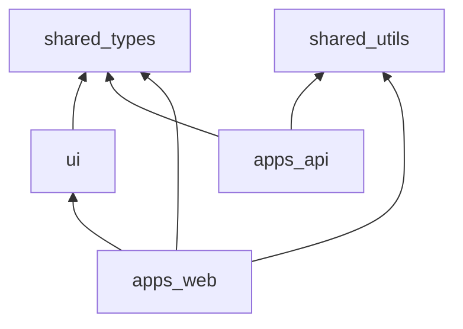

# Packages & Shared Libraries — SST

## Purpose

Specify shared packages responsibilities and dependency rules.

## Audience

Engineers adding libraries.

## Scope

MVP shared packages.

## Definitions

| Package | Role |
|---------|------|
| shared-types | Contracts |
| shared-utils | Pure helpers |
| ui | Presentational |

---

## @sst/shared-types

Contents:

- `Role` enum  
- Zod schemas for create/update DTOs mirrored with API  
- Dashboard filter types  
- RAG enum  

Must remain isomorphic (no Node/Prisma imports).

## @sst/shared-utils

- `normalizePhone`, `normalizeEmail`  
- `computeTaHandoffRag(ageDays, handoffDate)` — mirror business rules; unit tested  
- Date helpers  

Avoid putting secrets or env access here.

## @sst/ui

Optional. ShadCN wrappers, `RagBadge`, `DataTable` primitives. Web may keep components local initially then extract.

## @sst/eslint-config / typescript-config

Base `strict` TS; import order; no-floating-promises for API.

## Dependency direction

## Anti-patterns

- Importing `apps/api` from web  
- Dumping React components into shared-utils  
- Duplicating Zod in both apps without package  

## References

- [MONOREPO_STRUCTURE.md](./MONOREPO_STRUCTURE.md)  
- [../01-business-analysis/BUSINESS_RULES.md](../01-business-analysis/BUSINESS_RULES.md)  
