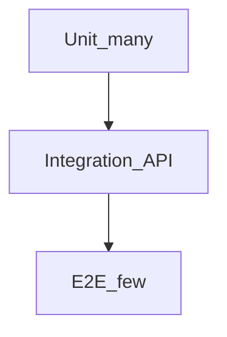

# Testing Strategy — SST

## Purpose

Enterprise testing guide for quality gates from unit to UAT.

## Audience

Engineers, QA, SDET, EM.

## Scope

MVP. Performance tools listed for later hardening.

## Definitions

| Layer | Meaning |
|-------|---------|
| Unit | Isolated functions/classes |
| Integration | API + DB |
| E2E | Browser journeys |
| UAT | Business acceptance |

---

## 1. Test pyramid



| Layer | Approx share | Tools |
|-------|--------------|-------|
| Unit | 70% | Vitest/Jest |
| Integration | 20% | Supertest + testcontainers/Postgres |
| E2E | 10% | Playwright |
| Component | as needed | Testing Library |

## 2. Unit testing

Focus:

- RAG/SLA calculators (Excel golden fixtures)  
- Duplicate normalization  
- Position open/closed math  
- Status transition guards  

Naming: `computeTaHandoffRag.spec.ts`

## 3. Integration / API testing

- Seed DB per suite  
- Auth as each role; assert 200/403 matrix  
- Happy paths for requirements→joined  

## 4. Component testing

Forms validation messages; DuplicateBadge rendering.

## 5. E2E testing

Journeys J1–J3 critical path smoke on each PR (headed CI optional nightly).

## 6. Performance / load / stress

Post-MVP or M4 optional:

- k6 scripts for list/dashboard endpoints  
- Targets from NFRs  

## 7. Security testing

- AuthZ matrix automation  
- `pnpm audit`  
- Basic OWASP ZAP against local (manual/nightly)  

## 8. Regression / smoke / UAT

| Type | When |
|------|------|
| Smoke | Post-deploy Compose up |
| Regression | Full suite on main |
| UAT | Stakeholder checklist vs Excel sample |

## 9. Mocking strategy

- Unit: mock repositories  
- Integration: real Postgres, no mocked Prisma  
- E2E: real stack via Compose  

## 10. Coverage strategy

| Area | Target |
|------|--------|
| Domain utils | ≥90% |
| Services | ≥70% |
| Controllers | via integration |
| Overall statements | ≥70% MVP gate |

## 11. CI testing pipeline

PR: lint → typecheck → unit → api integration → build  
Nightly: e2e + audit  

## 12. Bug lifecycle

```text
New → Triaged → In Progress → In Review → Verified → Closed
```

Severity: S1 blocker (auth/data loss) → S4 cosmetic.

## 13. Test data management

- Factories (`createRequirementFixture`)  
- Anonymized Excel extracts  
- Never production PII in CI  

## 14. Exit criteria (MVP)

- All Must FRs have tests or UAT evidence  
- AuthZ matrix automated  
- E2E J1–J3 green  
- Coverage thresholds met  

## References

- [TEST_STRUCTURE_AND_COVERAGE.md](./TEST_STRUCTURE_AND_COVERAGE.md)  
- [../01-business-analysis/BUSINESS_RULES.md](../01-business-analysis/BUSINESS_RULES.md)  
